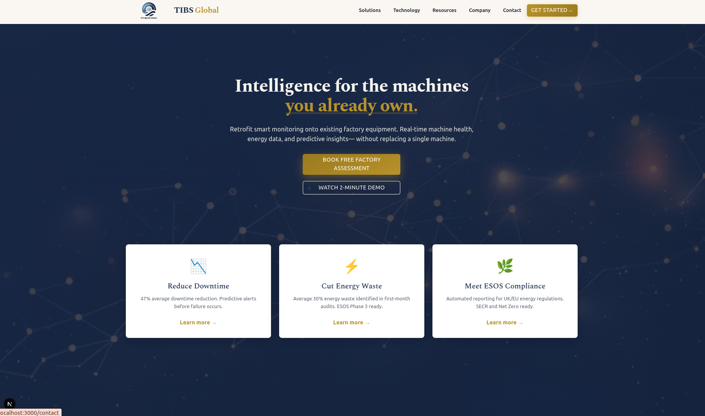
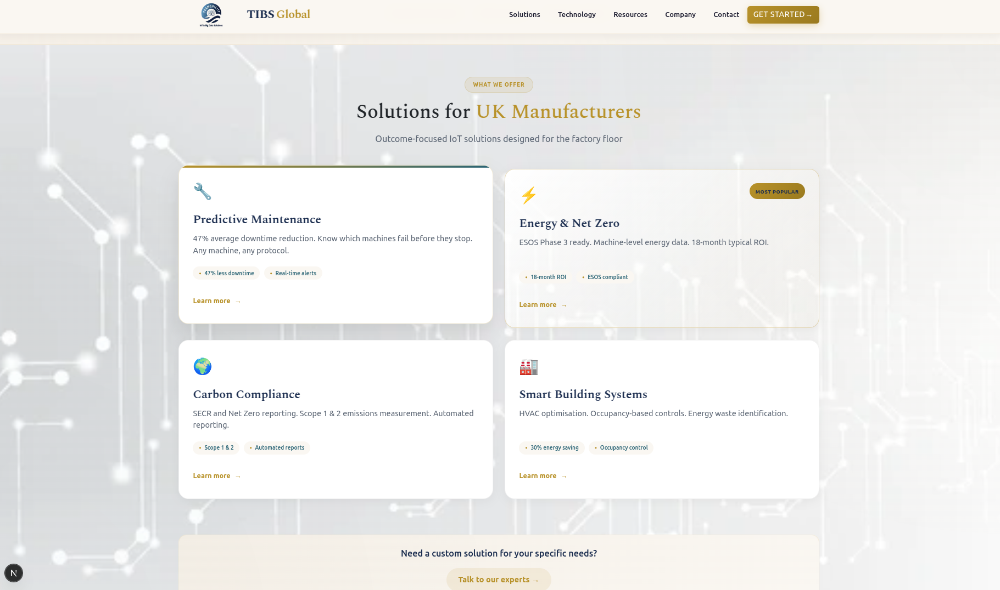
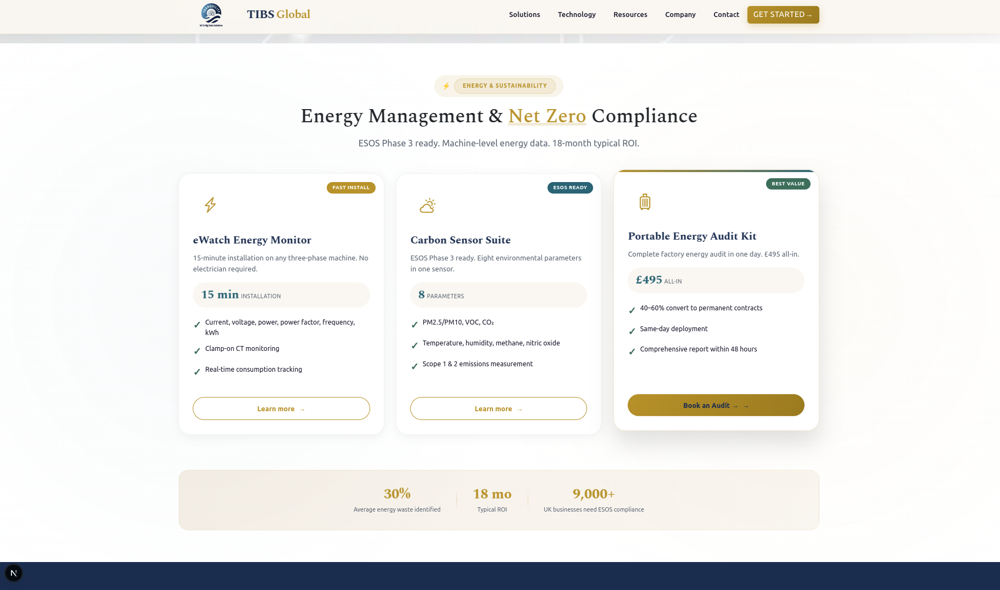
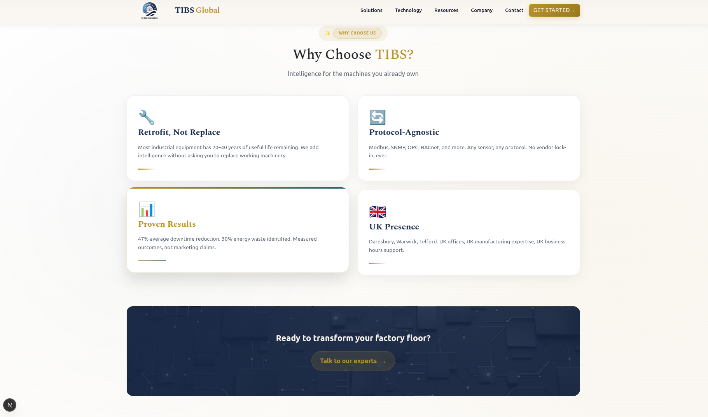
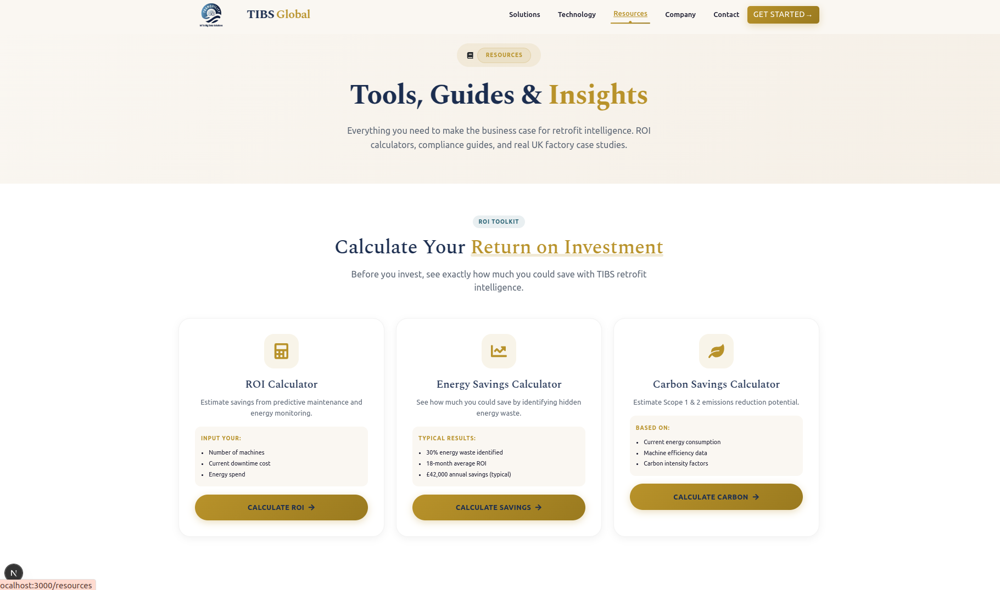
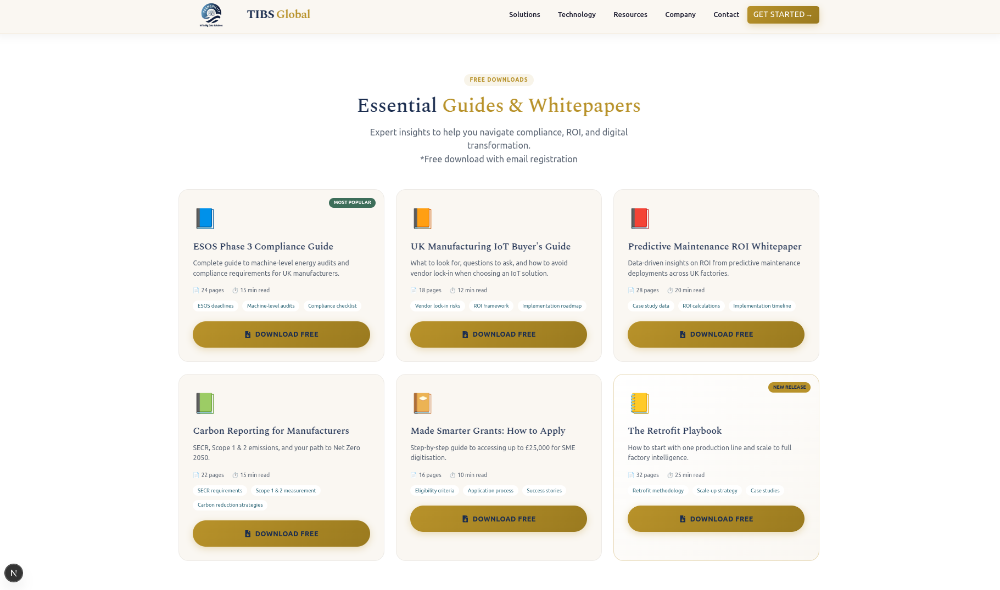
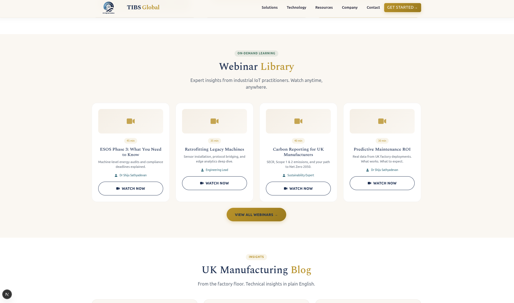
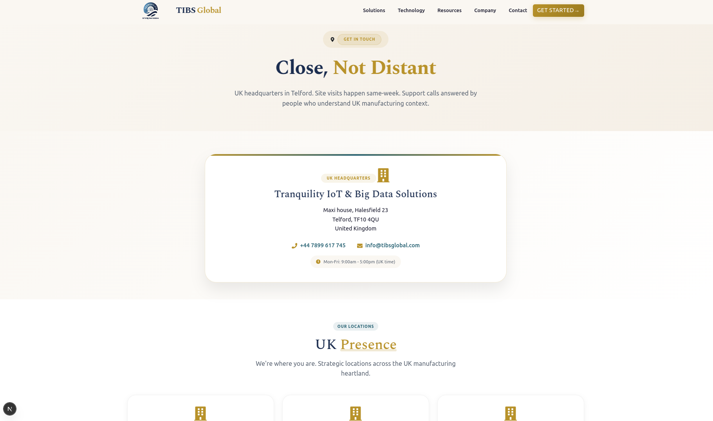
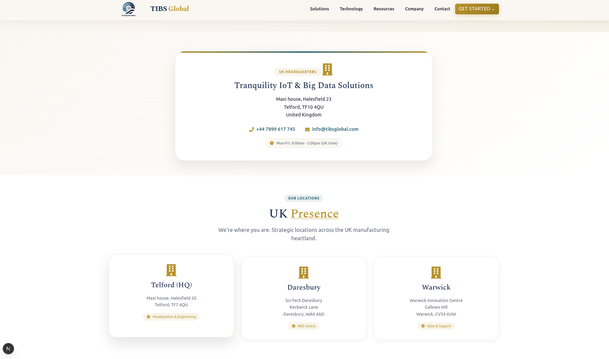

# TIBS Website (Frontend)

This repository contains the **frontend** of the **TIBS** website, an **IoT solutions company**. The frontend is built using **Next.js** and focuses on delivering a modern, responsive, and scalable web experience.

---

## 🏢 About TIBS

**TIBS** is an IoT-focused company providing technology-driven solutions for businesses. The website highlights the company’s offerings, technologies, and resources while enabling users to easily get in touch.

---

## 🚀 Tech Stack

* **Framework:** Next.js
* **Language:** JavaScript / TypeScript
* **UI Library:** React Bootstrap
* **Styling:** Bootstrap CSS
* **Routing:** Next.js App / Pages Router
* **Deployment Ready:** Yes

---

## 📄 Pages Implemented

The following screens/pages are completed in the frontend:

1. **Home**

   * Company overview
   * Key highlights and value proposition

2. **Solutions**

   * IoT solutions and services offered by TIBS

3. **Technology**

   * Technologies, platforms, and tools used

4. **Resources**

   * Blogs, insights, case studies, or documentation

5. **Contact**

   * Contact form and company contact information

---

## 📸 Screenshots

Below are some preview screenshots of the TIBS website UI. All screenshots are available in the `screenshots/` folder.

### 🏠 Home Page







### 🏠 Solution Page


### 🏠 Resources Page





### 🏠 Contact Page





### 🏠 Home Page


### 📞 Contact Page


---

## 📁 Project Structure (Frontend)

```
frontend/
├── components/     # Reusable UI components
├── pages/ or app/  # Application routes
├── public/         # Static assets
├── styles/         # Global and modular styles
├── package.json
└── next.config.js
```

---

## 🛠️ Getting Started

### Prerequisites

* Node.js (v16 or above)
* npm or yarn

### Installation

```bash
cd frontend
npm install
```

### Run Development Server

```bash
npm run dev
```

Open [http://localhost:3000](http://localhost:3000) in your browser.

---

## 📌 Status

* ✅ Frontend completed
* ⏳ Backend: Not included / In progress

---

## 📬 Contact

For any queries or collaborations related to the TIBS website, please use the **Contact** page on the site.

---

© TIBS – IoT Solutions Company
